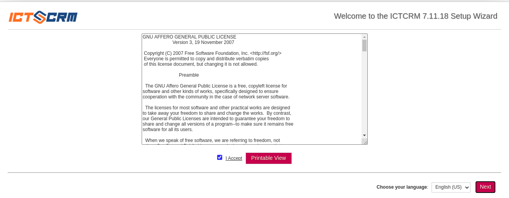
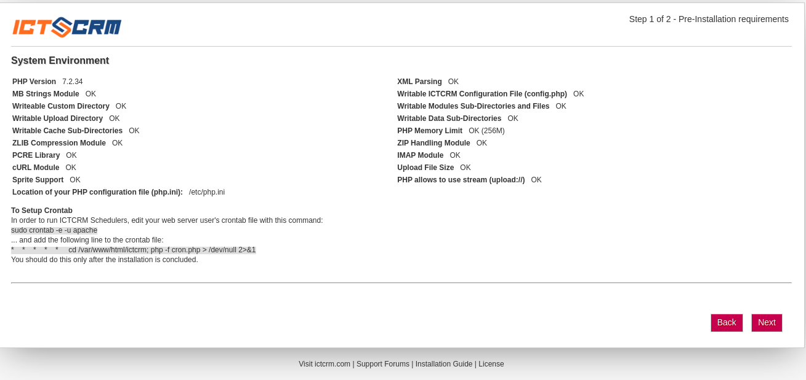
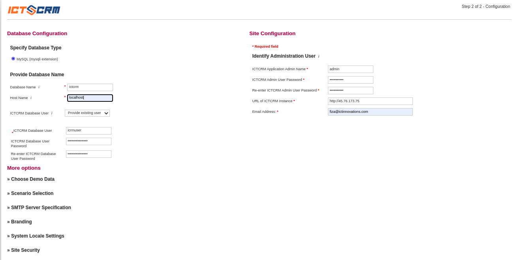
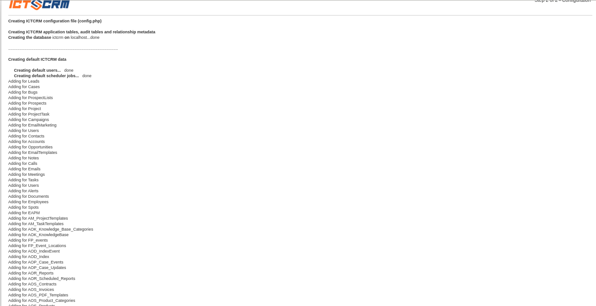
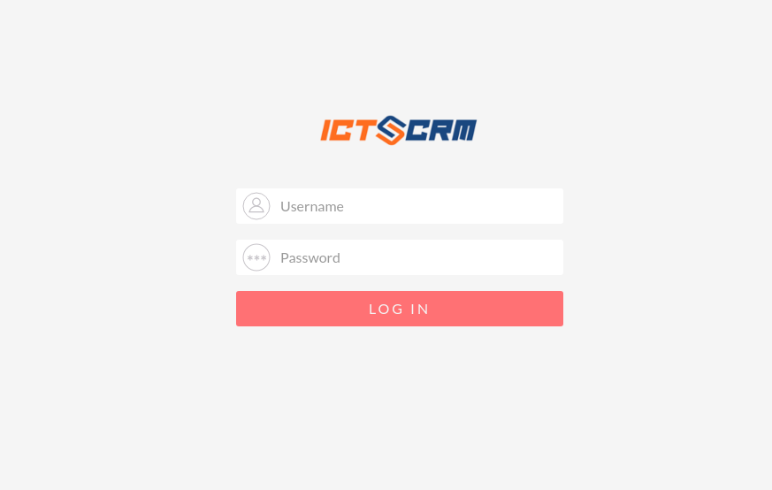

ICTCRM Installation guide
-------------------------

Install the useful packages

        dnf install -y wget nano rsync sysstat htop glances

Install additional necessary packages

        dnf install -y unzip httpd mariadb mariadb-server php php-mysqli php-gd php-xml php-mbstring php-pecl-zip php-imap php-pear-Net-Curl ImageMagick policycoreutils-python-utils

Download the source code from 

        git clone https://github.com/ictinnovations/ictcrm.git

Download it and place it inside the /var/www/html

        mv ictcrm /var/www/html

Set ownership

        chown -R apache:apache /var/www/html/ictcrm/

Set read/write permissions

        chmod -R 755 /var/www/html/ictcrm/
        chmod -R 775 /var/www/html/ictcrm/cache
        chmod -R 775 /var/www/html/ictcrm/custom
        chmod -R 775 /var/www/html/ictcrm/modules
        chmod -R 775 /var/www/html/ictcrm/themes
        chmod -R 775 /var/www/html/ictcrm/data
        chmod -R 775 /var/www/html/ictcrm/upload
        chmod 775 /var/www/html/ictcrm/config_override.php

Open the firewall for http

        firewall-cmd --zone=public --add-port=http/tcp --permanent
        firewall-cmd --reload

Start the mariadb and set to start on boot

        systemctl start mariadb
        systemctl enable mariadb

Create a database for ICTCRM and a user to access it.

        mysql -e "CREATE DATABASE ictcrm;"
        mysql -e "CREATE USER 'icrmuser'@'localhost' IDENTIFIED BY 'icrmuserpassword';"
        mysql -e "GRANT ALL ON ictcrm.* TO 'icrmuser'@'localhost';"
        mysql -e "FLUSH PRIVILEGES;"

Secure mariadb. These commands do what mysql\_secure\_installation does interactively

        mysql -e "UPDATE mysql.user SET Password=PASSWORD('somesecurepassword') WHERE User='root';"
        mysql -e "DELETE FROM mysql.user WHERE User='root' AND Host NOT IN ('localhost', '127.0.0.1', '::1');"
        mysql -e "DELETE FROM mysql.user WHERE User='';"
        mysql -e "DROP DATABASE test;"
        mysql -e "FLUSH PRIVILEGES;"

Tell SELinux to let it send mail and talk on the network

        setsebool -P httpd_can_sendmail 1
        setsebool -P httpd_can_network_connect 1

Tell SELinux that these directories need to write

        semanage fcontext -a -t httpd_sys_rw_content_t "/var/www/html/ictcrm/cache(/.*)?"
        restorecon -R /var/www/html/ictcrm/cache
        semanage fcontext -a -t httpd_sys_rw_content_t "/var/www/html/ictcrm/custom(/.*)?"
        restorecon -R /var/www/html/ictcrm/custom
        semanage fcontext -a -t httpd_sys_rw_content_t "/var/www/html/ictcrm/modules(/.*)?"
        restorecon -R /var/www/html/ictcrm/modules
        semanage fcontext -a -t httpd_sys_rw_content_t "/var/www/html/ictcrm/themes(/.*)?"
        restorecon -R /var/www/html/ictcrm/themes
        semanage fcontext -a -t httpd_sys_rw_content_t "/var/www/html/ictcrm/data(/.*)?"
        restorecon -R /var/www/html/ictcrm/data
        semanage fcontext -a -t httpd_sys_rw_content_t "/var/www/html/ictcrm/upload(/.*)?"
        restorecon -R /var/www/html/ictcrm/upload
        semanage fcontext -a -t httpd_sys_rw_content_t "/var/www/html/ictcrm/config_override.php"
        restorecon -R /var/www/html/ictcrm/config_override.php

Edit /etc/php.ini to have the following settings 

        sed -i -e 's/post_max_size = 8M/post_max_size = 60M/' /etc/php.ini
        sed -i -e 's/upload_max_filesize = 2M/upload_max_filesize = 60M/' /etc/php.ini
        sed -i -e 's/max_input_time = 60/max_input_time = 300/' /etc/php.ini
        sed -i -e 's/memory_limit = 128M/memory_limit = 256M/' /etc/php.ini

Create an Apache virtual host file

        cat > /etc/httpd/conf.d/ictcrm.conf << EOF
        LoadModule rewrite_module modules/mod_rewrite.so

        <VirtualHost *:80>
        ServerAdmin webmaster@localhost
            <Directory /var/www/html/ictcrm>
                Allow From All
                AllowOverride All
                Options +Indexes
           </Directory>
           DocumentRoot /var/www/html/ictcrm
           ServerName crm.domain.com
               ErrorLog /var/log/httpd/ictcrm.error.log
               CustomLog /var/log/access.log combined
        </VirtualHost>
        EOF

Restart Apache and enable for reboot.

        systemctl restart httpd
        systemctl enable httpd

Disbale SELinux temporarily.

        setenforce 0 

Open the `modules/Campaigns/language/en_us.lang.php` file and find the following lines

        LBL_EMAIL_HREF => 'http://ictdialeripaddress/#/pages/campaigns/campaigns/sendemail/new',
        LBL_VOICE_HREF => 'http://ictdialeripaddress/#/pages/campaigns/campaigns/voicemessage/new',
        LBL_FAX_HREF => 'http://ictdialeripaddress/#/pages/campaigns/campaigns/sendfax/new',
        LBL_SMS_HREF => 'http://ictdialeripaddress/#/pages/campaigns/campaigns/sendsms/new'

Here replace the `ictdialeripaddress` with IP address of the server on which ICTDialer is running.

Now visit your IP Address your\_ip\_address/install.php and you will see the following screen:

Accept the license and click the **Next** button.

  

  

After accepting the license following screen will be displayed. Here it will check the environment and will see that the required modules are writeable and will display the errors.

  

  

  

If this page does not display any error, click the **Next** button. Here it will show you the following system environment.

  

  

  

Check the configuration and click the **Next** button. Next, setup the database configuration

  

  

  

Enter all of the required fields and than click the **Next** button. Here it will check the database configuration and will make sure they are correct and than after verifying it will create the ICTCRM default data configuration and following screen will be displayed

  

  

  

Here click the Next button and you will be redirected to the ICTCRM login page.

  

  

  

Congratulations ICTCRM is successfully installed. Login by providing the username and password and start using ICTCRM.

