ICTCRM User Guide
-----------------

ICTCRM has been developed using open source SuiteCRM software https://suitecrm.com/ and open source communications framwork ICTCore http://www.ictcore.org and we have enhanced its functionality by adding computer telephony integeration (CTI ) features and functionlity .

ICTCRM is a modern CRM software integerated with CTI to manage your organization's daily buisness and communications needs, It is suiteable for small, medium and large companies . You can manage your telamarketing campaigns either through sms, voice, email or fax .

### Sign in

To start using the ICTCRM, firstly open the ICTCRM and login to the panel.

Enter your username and password and press the **Enter** button.

  

  

Once you have logged in, following Dashboard screen will appear.

  

  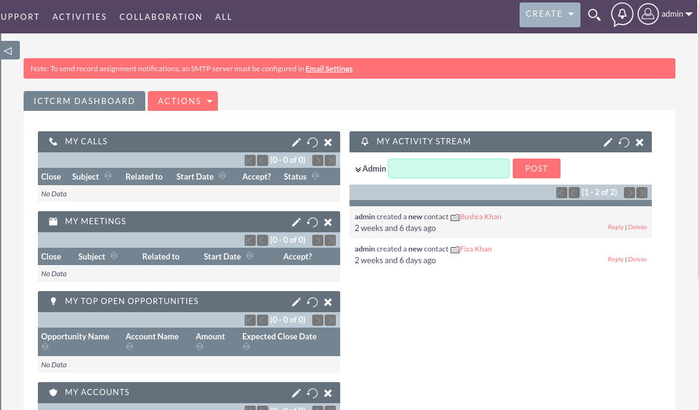

 

Here it contains the statistics and recent activity of the user.

### Campaign management

To manage the ICTCRM Campaign, Open the Campaign module for this Select the **Marketing Tab** in the header and Choose **Campaigns**.

  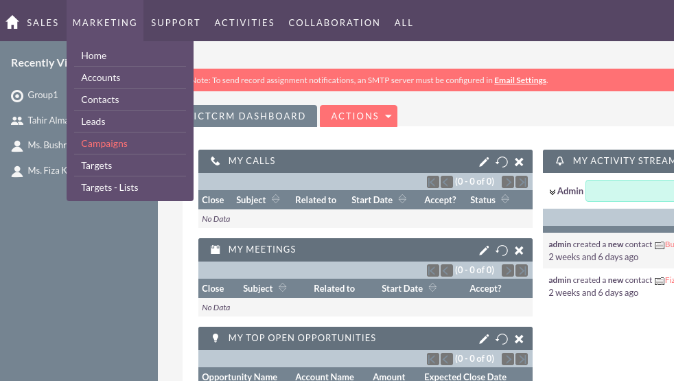

  

Following Campaign management module will open

 

  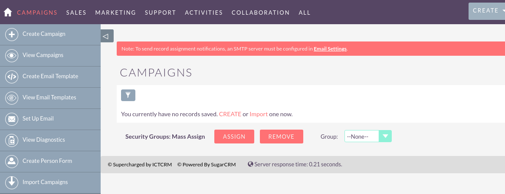

  

Here Select the **Create Campaign** button from the top left and following screen will be shown

 

  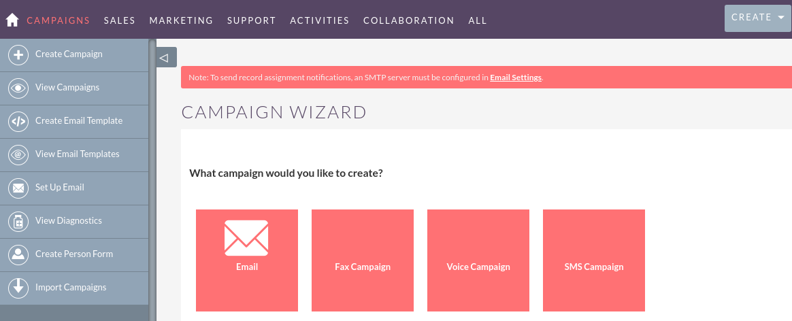

#### Email Campaign

In order to start the **Email Campaign** click on it in the campaign Wizard

 

  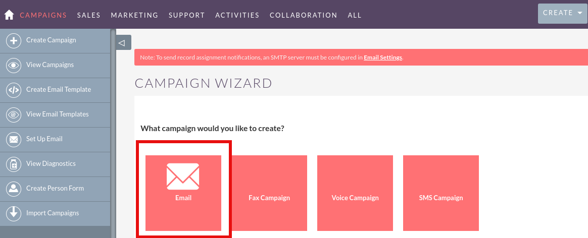

  

and it will take you to the ICTDialer where all of the target list are aleady fetched you only need to select the Email template and Press the **Submit** button and email campaign will be launced.

  

  

#### SMS Campaign

In order to start the **SMS Campaign** click on it in the campaign Wizard

 

  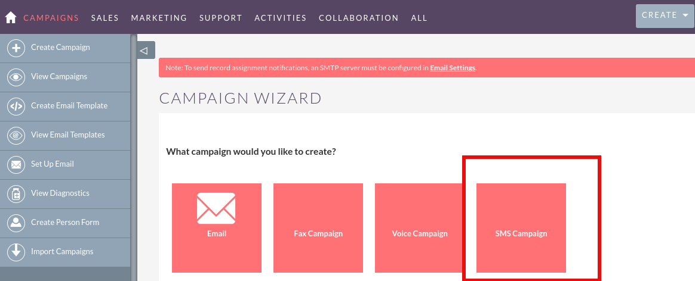

  

and it will take you to the ICTDialer where all of the target list are aleady fetched you only need to select the SMS Text and Press the **Submit** button and sms campaign will be launced.

  

  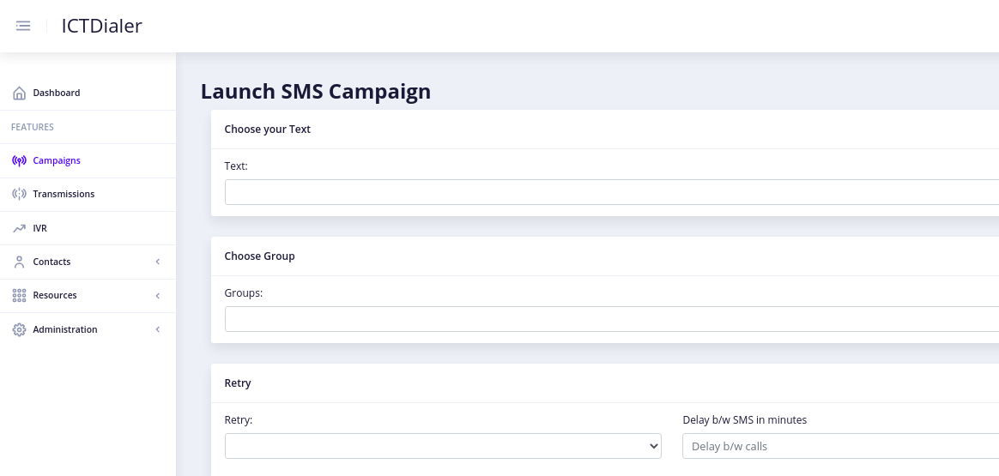

#### Voice Campaign

In order to start the **Voice Campaign** click on it in the campaign Wizard

 

  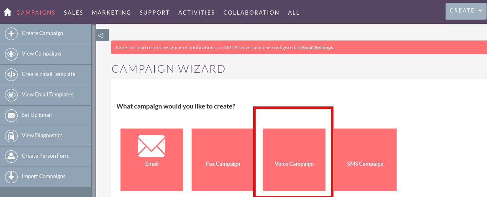

  

and it will take you to the ICTDialer where all of the target list are aleady fetched you only need to select the Voice message and Press the **Submit** button and voice campaign will be launced.

  

  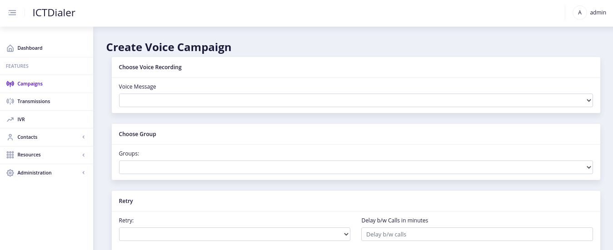

#### Fax Campaign

In order to start the **Fax Campaign** click on it in the campaign Wizard

 

  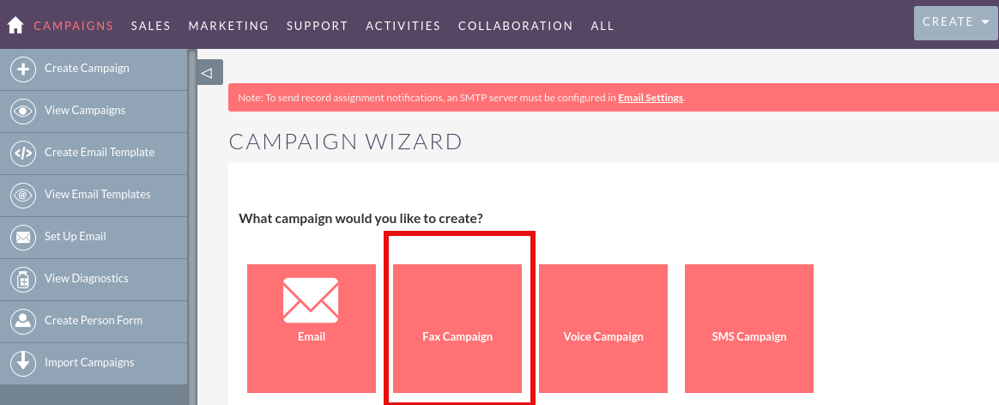

  

and it will take you to the ICTDialer where all of the target list are aleady fetched you only need to select the Fax document and Press the **Submit** button and fax campaign will be launced.

  

  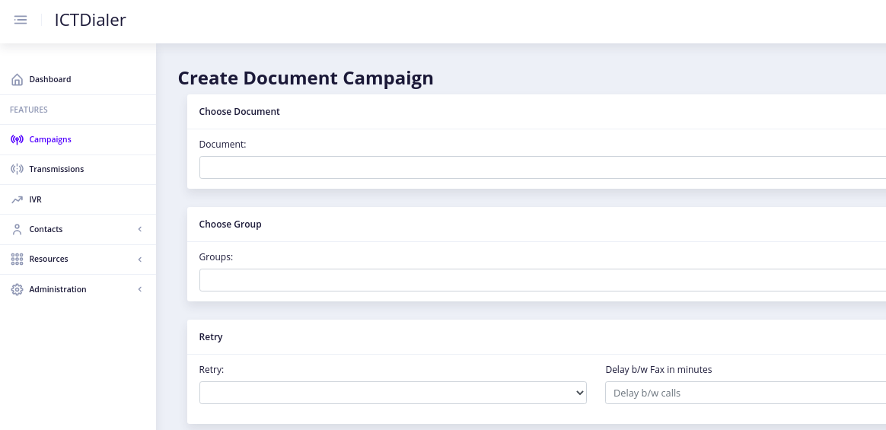

  

For more information on ICTCRM Other modules please see the [SuiteCRM Guide](https://docs.suitecrm.com/user/).

For more information on ICTDialer User guide please see the [ICTDialer User Guide](https://github.com/ictinnovations/ictdialer/blob/master/doc/ictdialer_user_guide.pdf)
